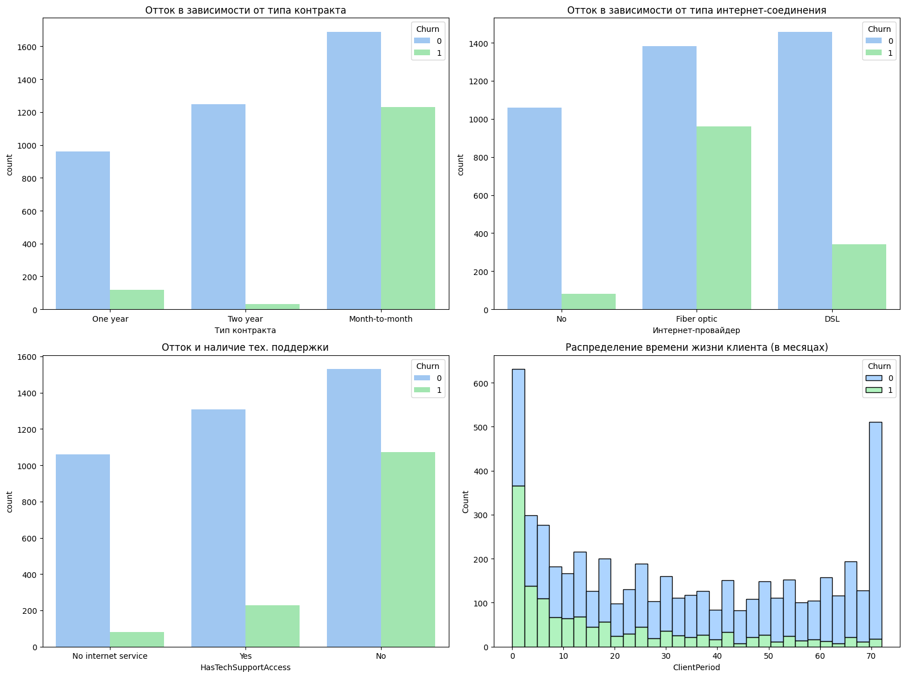
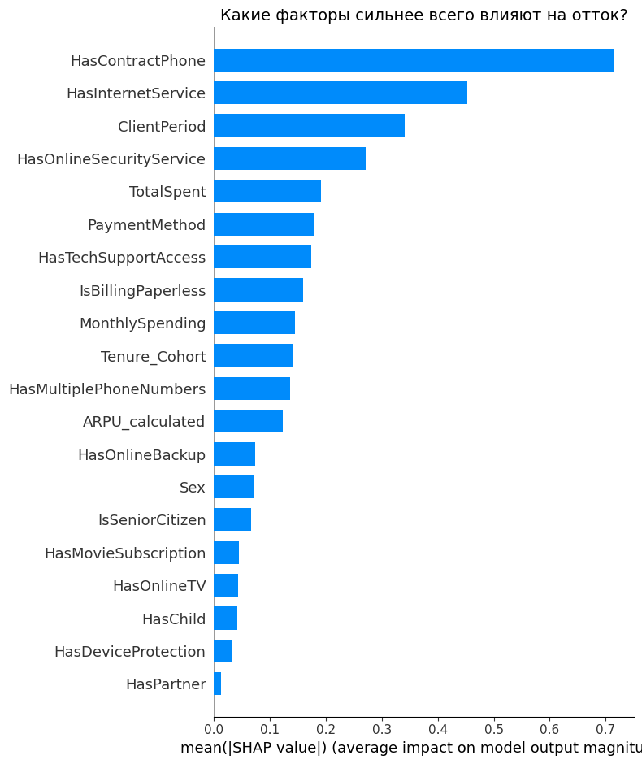
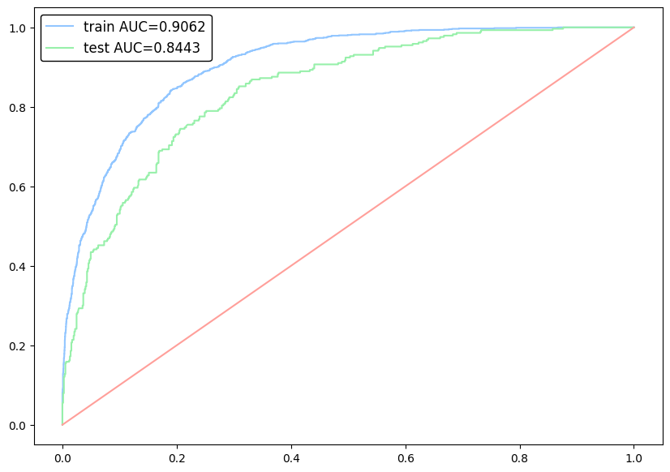
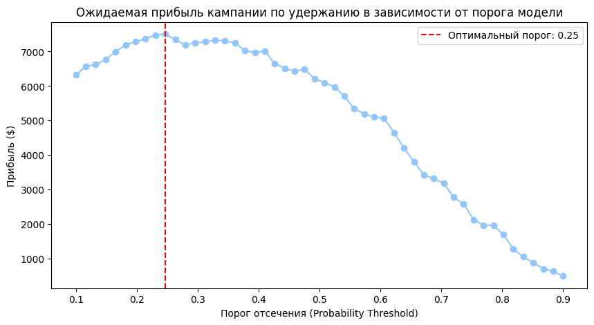

# 📱 Telecom Customer Churn Prediction & Retention Strategy

## 📌 О проекте
Этот проект представляет собой комплексное исследование оттока клиентов (Churn) телеком-оператора. Главная цель — не просто построить ML-модель с высокой метрикой, а разработать экономически обоснованную стратегию удержания, которая поможет бизнесу максимизировать прибыль и снизить затраты на маркетинг.

## 🎯 Бизнес-контекст
Привлечение нового клиента (CAC) всегда обходится компании значительно дороже, чем удержание текущего. В рамках проекта решаются следующие задачи:
* **Выявление ключевых драйверов оттока** (почему клиенты уходят?).
* **Прогнозирование вероятности ухода** клиента в следующем месяце.
* **Расчет unit-экономики** кампании по удержанию (при каком пороге вероятности компании выгодно предлагать клиенту скидку).

## 📊 Ключевые инсайты (EDA & SHAP)
В ходе исследовательского анализа и интерпретации модели (с помощью SHAP values) были выявлены следующие паттерны:
* **Критический период** — первые 1-3 месяца. Наибольший риск оттока наблюдается на этапе онбординга.
* **Тип контракта:** Клиенты с контрактом "Month-to-month" уходят в разы чаще, чем клиенты с долгосрочными обязательствами.
* **Fiber Optic:** Пользователи оптоволокна демонстрируют аномально высокий уровень оттока, что может сигнализировать о проблемах с качеством или завышенной цене услуги.

## 🤖 Моделирование и ML
* **Созданы новые бизнес-метрики** (Feature Engineering): `ARPU` (Average Revenue Per User) и `Tenure Cohorts`.
* **Обучена градиентная бустинговая модель** `CatBoost`. Алгоритм выбран благодаря своей устойчивости к переобучению и отличной встроенной работе с категориальными признаками.
* **Метрика качества:** Модель показала высокий уровень классификации по метрике **ROC-AUC (0.84)**.

## 💰 Экономика продукта (Financial Model)
В проекте реализован расчет оптимального порога отсечения (probability threshold) для максимизации прибыли от промо-кампании. Учтен баланс между:
* **True Positives (Профит):** Сохраненная выручка удержанного клиента.
* **False Positives (Убыток):** Деньги, потерянные на скидке, выданной лояльному клиенту (каннибализация выручки).

**Итоговые рекомендации для бизнеса:**
* Выдавать скидку 20% клиентам с вероятностью оттока **> 0.65 (High Risk)**.
* Использовать бесплатные методы удержания (звонок саппорта) для клиентов в зоне **0.35 - 0.65 (Medium Risk)**.
* Внедрить программы геймификации в первые 90 дней жизни клиента.

## 🛠 Технологический стек
* **Язык:** Python
* **Анализ данных и EDA:** Pandas, Numpy, Matplotlib, Seaborn
* **Машинное обучение:** Scikit-Learn, CatBoost
* **Интерпретация моделей:** SHAP (Shapley Additive exPlanations)
